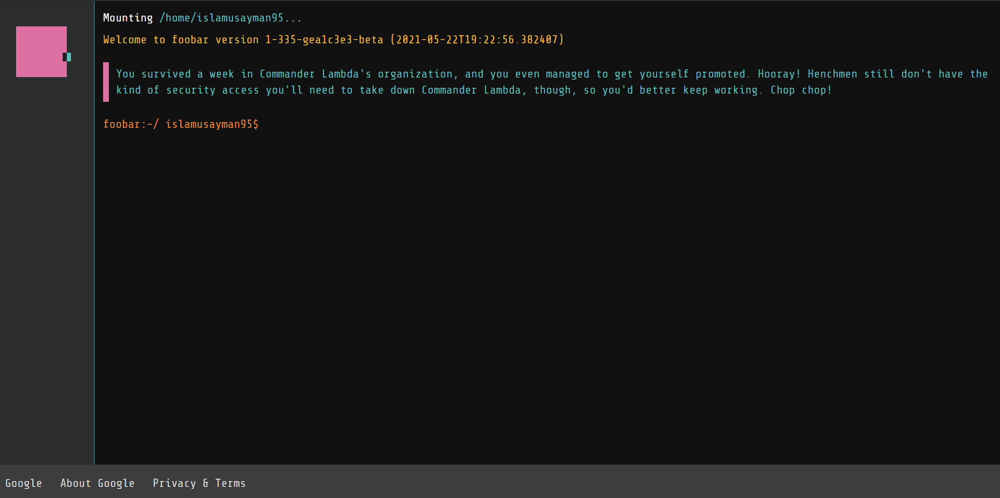

# Google Foobar challenges

## Sections

### [Level #1](level_1):

- Mine: [The Cake is not a Lie](level_1/minion_task_scheduling)
- [Minion Task Scheduling](level_1/minion_task_scheduling)

### [Level 2](level_2):

- Mine: [Ion Flux relabeling](level_2/ion_flux_relabeling)
- [En Route Salute](level_2/en_route_salute)
- [Numbers Station Coded Messages](level_2/numbers_station_coded_messages)

### [Level 3](level_3):

- [Find the Access Codes](level_3/find_the_access_codes)
- [Queue to Do](level_3/queue_to_do)

### Level 4:

### Level 5:
