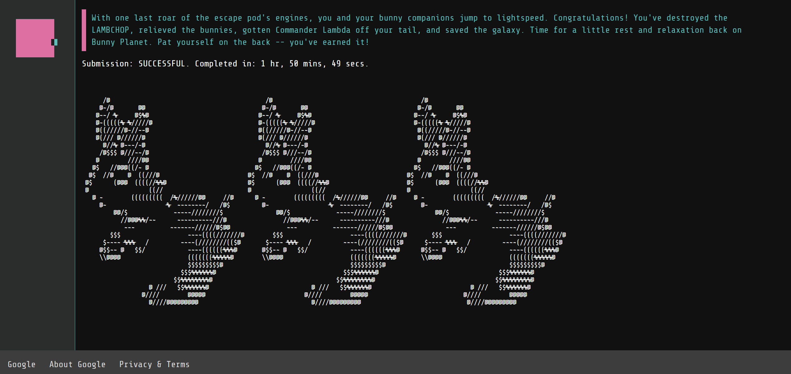

# Google Foobar challenge
#### Google Foobar challenge solutions from my experience and other's on the web.

#### Note: 
> Problems indicated with "Mine" are tested and verified through the platform directly and other problems are not verified, so you may get failed tests.
## Sections

### [Level #1](level_1):

> You will be given one challenge

- Mine: [The Cake is not a Lie](level_1/minion_task_scheduling)
- [Minion Task Scheduling](level_1/minion_task_scheduling)

### [Level #2](level_2):

> I received two challenges

- Mine: [Ion Flux relabeling](level_2/ion_flux_relabeling)
- Mine: [Please Pass the Coded Messages](level_2/please_pass_the_coded_messages)
- [En Route Salute](level_2/en_route_salute)
- [Numbers Station Coded Messages](level_2/numbers_station_coded_messages)
> After solving level challenges, I got:
> To invite a friend to try a challenge, send the link below. This is a single-use code, so choose wisely.

> Refer a friend: "https://foobar.withgoogle.com/?eid=VUGHM" (Unused)

### [Level #3](level_3):
> I received three challenges
 
- Mine: [Prepare The Bunnies Escape](level_3/prepare_the_bunnies_escape)
- Mine: [The Grandest Staircase Of Them All](level_3/the_grandest_staircase_of_them_all)
- Mine: [Fuel Injection Perfection](level_3/fuel_injection_perfection)
- [Find the Access Codes](level_3/find_the_access_codes)
- [Queue to Do](level_3/queue_to_do)

#### After submitting full level solutions

### [Level 4](level_4):
> I received two challenges

- Mine: [Free The Bunny Workers](level_4/free_the_bunny_workers)
- Mine: [Bringing a Gun to a Trainer Fight](level_4/bringing_a_gun_to_a_trainer_fight)

#### After completing the level
>It's dangerous to go alone! To invite a friend to try a challenge, send the link below. This is a single-use code, so choose wisely.

>Refer a friend: "https://foobar.withgoogle.com/?eid=xxxxx" (Unused)
>Refer a friend: "https://foobar.withgoogle.com/?eid=VUGHM" (Used)

### [Level 5](level_5):
> I received one challenge
 
- Mine: [Dodge the Lasers!](level_5/dodge_the_lasers)

## Useful Resources 
- [Solving Google Foobar and hacking it along the way](https://govanify.com/post/foobar/)
- [Arink Verma Github](https://github.com/arinkverma/google-foobar)
- [Neeraj Aggarwal Github](https://github.com/n3a9/google-foobar)
- [Shrey Shah Post](https://pages.cs.wisc.edu/~shrey/2020/08/10/google-foobar.html)
- [Shrey Shah Github](https://github.com/shreykshah/google-foobar)
- [Rudy Puig Github](https://github.com/rudisimo/google-foobar)
- [Sage Callon Github](https://github.com/FoxHub/Google-FooBar)
- [Google’s FooBar Challenge | See How I Passed Levels 1 to 5 in Real-Time](https://blog.finxter.com/googles-foobar/)
